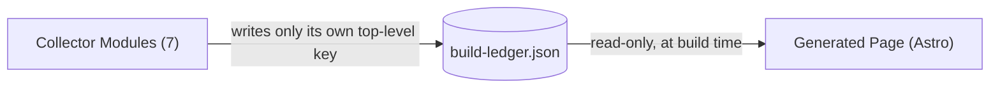
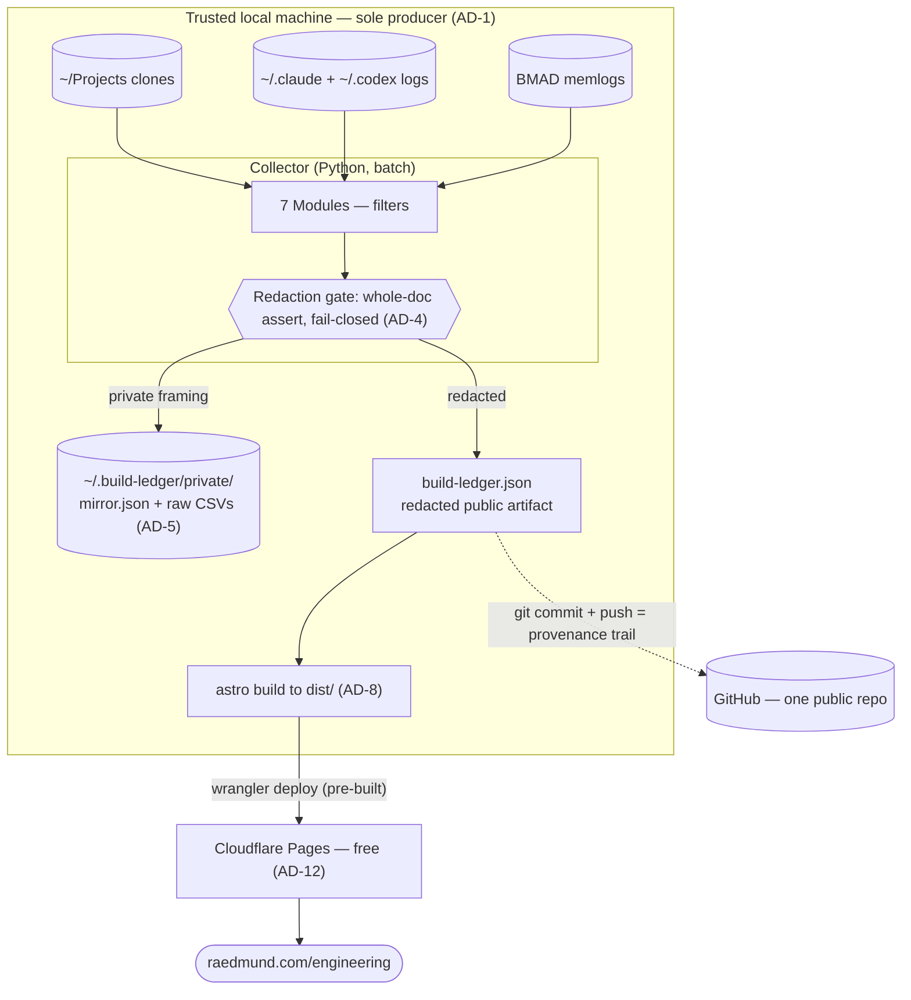

# Architecture Spine — Build Ledger

*One local pipeline computes evidence from real repositories, redacts it fail-closed, and emits a single versioned file that a static page renders. Collector and page are coupled by that file and nothing else.*

## Design Paradigm

**Pipes-and-filters behind a versioned data contract.** The Collector is a batch pipeline of independent Modules ("filters"), each computing one slice of evidence and writing one section of a single immutable artifact — `build-ledger.json` (the "pipe" / contract) — which a read-only static renderer (the Generated Page) consumes. Dataflow is one-directional; there is no shared mutable state and no live query surface; the JSON file is the **only** coupling between the two halves, which is precisely what lets them be built, changed, and inspected independently. Layers map to directories: `collector/` (the filters + the central redaction gate), the PRD-defined `build-ledger.json` contract, `site/` (the Astro renderer).

## Invariants & Rules

The durable heart — calls a future builder (or a parallel Module) can't read off compliant code. `[ADOPTED]` marks a decision the user or existing reality already settled.

**Allowed dependency direction** (this graph *is* a rule):



No Module depends on another Module; the Page never reaches past the contract to the Collector. The file is the membrane.

### AD-1 — Local-primary runtime `[ADOPTED]`
- **Binds:** all Modules; FR-7 (schedule), FR-9 (publish).
- **Prevents:** private client code reaching third-party CI; the hero/practice/mirror Modules being silently unavailable; divergent run environments.
- **Rule:** the Collector runs **only** on a trusted local machine that holds the repo clones, agent logs, and BMAD memlogs; it is the **sole producer** of both `build-ledger.json` and the private mirror. Weekly cadence is a **local scheduler** (`launchd`/cron), never GitHub Actions. Private repository contents/history, local agent logs, and the GitHub auth token (local `gh`/env only) **never** transit a third-party runner. The only artifact that may leave the machine is the post-redaction public `build-ledger.json` (+ the page built from it).
- **Supersedes:** the PRD's "weekly GitHub Action" mechanism (FR-7, Platform, Safety). The same FR-6 privacy invariant that forbids cloning ~35 private client repos onto a third-party runner forces local-primary, so the GitHub token is a **local** secret, not "held by the Action." *(PRD wording to be reconciled — see handoff.)*

### AD-2 — Single versioned data contract `[ADOPTED]`
- **Binds:** FR-8; every Module; the Page.
- **Prevents:** collector and page drifting apart; hidden coupling outside the file.
- **Rule:** the PRD's `build-ledger.json` shape is the authoritative single source of truth. Every Module emits into it; the Page renders **solely** from it (removing the Collector does not change what a given file can display). It carries a `schema_version`. No other channel couples the two halves.

### AD-3 — Module ownership & explicit availability `[ADOPTED]`
- **Binds:** all seven Modules; FR-8.
- **Prevents:** seven independently-built Modules colliding, cross-writing, or silently vanishing.
- **Rule:** each Module owns a defined **slice** of the contract — either a whole top-level key, or a named **field-path** within a shared collection (see AD-13/AD-14) — and is the only writer of that slice; no Module reads or writes another's slice; the Collector is the sole writer of the file. A Module with no data this run emits `available: false` with **typed-empty** sub-objects matching the populated shape — never silent omission, never a bare `{}`/`[]` the page must guess at.

### AD-4 — Safe-by-default, fail-closed, whole-document redaction `[ADOPTED]`
- **Binds:** FR-6; the entire public file; publish step.
- **Prevents:** any private repo name/path/branch/commit message/client name/secret/transcript reaching the public surface.
- **Rule:** every private repo defaults to `display_tier: aggregate_only` (a Silhouette). Before publish, a single redaction pass asserts over the **entire** document (all of `repositories[]`, `aggregates`, `agentic_practice` incl. free-text confounders, `retrospective.window_view`, `in_flight`) that none of the prohibited fields appear; if the assertion fails, **the run does not publish** (fail-closed). The **Allowlist** is the only mechanism that promotes a repo above `aggregate_only`, and ships **empty** in v1 (so every private repo is a Silhouette, every `allowlisted` is `false`). The rules are reviewable config, reviewed before any private clone. `display_tier` is a fixed **three-value** enum — `public` (name + metrics) | `redacted` (generic description, no name) | `aggregate_only` (Silhouette); v1 uses only `public` + `aggregate_only`, but `redacted` stays defined and representable so the first post-v1 promotion needs no schema change. Free-text-bearing fields (`agentic_practice.cost.confounders`, language/model labels, `in_flight`, `retrospective.window_view`) are constrained to a **controlled vocabulary / aggregate integers by construction** (an allowlist); the whole-document assert is the fail-closed **backstop**, because a denylist cannot catch a *novel* client name.

### AD-5 — Private outputs live outside the repo tree `[ADOPTED]`
- **Binds:** FR-6; project layout (the single public repo).
- **Prevents:** private data ever entering a publishable tree — by construction, not by gitignore-discipline.
- **Rule:** the Collector writes every private output (`mirror.json`, raw evidence CSVs, per-client intermediates) to a path **outside** any source-controlled tree (a local drawer, e.g. `~/.build-ledger/private/`), and reads clones from `~/Projects` (also external). The one public repo therefore **cannot** contain private data structurally. Any in-tree `private/` path is additionally gitignored (defense-in-depth). The sole private→public crossing is the single redacted `build-ledger.json` after its AD-4 assert.

### AD-6 — The Mirror View never enters the public file `[ADOPTED]`
- **Binds:** FR-6, FR-11; `retrospective`.
- **Prevents:** leaking the brutally-honest, private-repo-sourced mirror.
- **Rule:** the public `retrospective` carries `window_view` **only**. The `mirror_view` is written to the separate private `mirror.json` (in the drawer, AD-5), never published and never linked. Machine-checkable: the published `build-ledger.json` has no `retrospective.mirror_view` key.

### AD-7 — Semantic schema versioning `[ADOPTED]`
- **Binds:** FR-8; the Page's render contract; the v1.5 growth path.
- **Prevents:** a contract change silently breaking a deployed page, or forward features forcing a v1 rewrite.
- **Rule:** `schema_version` is semver `MAJOR.MINOR.PATCH` (v1 = `1.0.0`). **Additive** changes (new optional keys) bump **MINOR** and must not break a page built for an earlier MINOR — the optional multi-layer `attribution` representation (v1.5 line-level + Acceptance Ratio) is the worked example (`→1.1.0`), leaving the v1 `coauthorship` key untouched. **Breaking** changes (rename/remove a load-bearing key, change a meaning, tighten redaction non-back-compat) bump **MAJOR**; the Page declares the MAJOR it supports and **refuses** an unsupported MAJOR rather than mis-render.

### AD-8 — Build-time static render `[ADOPTED]`
- **Binds:** FR-2, FR-9, FR-10; the publish step.
- **Prevents:** page and publish diverging on how the file is consumed; a JS-bundle inspection surface on a graded work-sample.
- **Rule:** the Page is generated **at build time** from `build-ledger.json` into static HTML/CSS/SVG (charts are server-generated inline SVG — no charting library; islands only where genuinely interactive). The published `build-ledger.json` is served beside the page so a reader can diff page-against-file. v1 site = a minimal Astro shell + the `/engineering` page only.

### AD-9 — Aggregate-only, no raw transcripts `[ADOPTED]`
- **Binds:** FR-5, FR-6, FR-13; `agentic_practice`, `retrospective`, `attribution`.
- **Prevents:** session/transcript content leaking through the log-derived Modules.
- **Rule:** no raw transcript or session-log text ever enters `build-ledger.json` or the page. Modules sourced from local agent logs (Agentic Practice, the v1.5 line-level Attribution) emit **aggregate counts/ratios only**, computed by script.

### AD-10 — Provenance-first, anti-vanity contract `[ADOPTED]`
- **Binds:** FR-2, FR-3; the contract shape; the page hero.
- **Prevents:** the artifact decaying into a "nicer GitHub profile" or a spend brag.
- **Rule:** the contract is provenance-first and anti-vanity *by construction*: the hero data (Co-Authorship Split + AI-Native Artefacts) is first-class and always present; the commit-level AI-co-authored share carries `unit: "commit"` and is labelled an explicit **lower bound**, never the total; the contract carries **no** spend/token-leaderboard, "Wrapped"-recap, or live-counter structure (rejected in all versions), and the Acceptance Ratio (v1.5) is the only sanctioned quality signal, itself not a maximization target. Page *emphasis* (hero placement, volume demoted to supporting cast) is a presentation convention the PRD/UX owns — the contract enables it but does not enforce layout.

### AD-11 — Auditable cost or none `[ADOPTED]`
- **Binds:** FR-5; `agentic_practice.cost`.
- **Prevents:** invented or unverifiable economics.
- **Rule:** cost is derived from figures the agent logs already record, or from a **pinned, dated, published** price table shipped in-repo (with a source link); the price source + as-of date are shown on the page. Cost is **never** estimated; an unsourceable figure is **omitted**, not guessed.

### AD-12 — Pre-built local deploy to a free static host `[ADOPTED]`
- **Binds:** FR-7, FR-9; the publish step; the $0 constraint.
- **Prevents:** a host build re-introducing a CI dependency or a surprise bill.
- **Rule:** the Page is built locally and deployed **pre-built** (`dist/`) to a free static host — no host build minutes, no GitHub Actions, $0. The specific host is **seed/swappable** (any static host serves `dist/` identically); the recommended default is Cloudflare Pages (free tier, unlimited bandwidth, deploy via `wrangler pages deploy`).

### AD-13 — The Collector assembles shared collections; Modules contribute by id `[ADOPTED]`
- **Binds:** `repositories[]`; FR-1, FR-3, FR-4; AD-3.
- **Prevents:** two Modules minting mismatched-length / mismatched-order `repositories[]` lists joined on an unowned `id`.
- **Rule:** the `repositories[]` array is owned and assembled by the Collector entrypoint (`collect.py`), which establishes the repo set and the stable `id` for each row. Per-repo Modules (`repos`, `coauthorship`, `artefacts`) do **not** build the array; each returns an **id-keyed map** of its own field-path (e.g. `coauthorship.py` → `{id: {…}}`), and the assembler merges them by `id`. One writer per **field-path**, one owner of the array, one source of `id`.

### AD-14 — Aggregates are a derived projection, never hand-written `[ADOPTED]`
- **Binds:** `aggregates`; FR-1, FR-2; AD-10.
- **Prevents:** headline totals that don't reconcile with the rows a skeptic drills into.
- **Rule:** `aggregates` (repo counts, language shares, `totals` incl. `user_authored_commits`) are computed by the assembler as a **pure function of the already-emitted `repositories[]`** after every per-repo Module has contributed — never written by any Module. A figure in `aggregates` must equal the sum/derivation of the rows it summarizes (reconcilable by construction — the auditability NFR made structural).

### AD-15 — One atomic, deterministic, fail-closed run `[ADOPTED]`
- **Binds:** FR-7, FR-8, FR-6; the publish step.
- **Prevents:** a half-old / torn published file; non-reproducible churn; redaction running before aggregation.
- **Rule:** a run builds the **entire** document in memory in a fixed Module order, then writes it via **atomic replace** (temp + rename) — never incrementally over the live file. The pipeline order is pinned: **tiering** (assign `display_tier`) → per-repo Module contributions → **aggregation** (AD-14) → **whole-document redaction assert** (AD-4 — final, assert-only, mutates nothing) → atomic write. A **degraded** Module (no/failed data) sets its own `available: false` and the run continues; a **fatal** error (redaction assert fails, or the document can't be made schema-valid) aborts the publish entirely (fail-closed). Output is deterministic (stable ordering) so the committed `build-ledger.json` diff reflects real change, not churn.

## Consistency Conventions

| Concern | Convention |
| --- | --- |
| **Naming** | `build-ledger.json` keys: `snake_case`. Each Module owns one **slice** (a top-level key, or a per-repo field-path under `repositories[]` — AD-13). Collector: one file per Module under `collector/modules/<name>.py`. Astro: each page section component named for its JSON key. |
| **Data & formats** | Dates: ISO-8601 UTC (`…Z`). `schema_version`: semver string (`1.0.0`), present at top level **and** in `ledger_metadata` — the two MUST be equal (the page reads `ledger_metadata.schema_version`). Repo `id`: stable opaque string (the assembler's, AD-13). Shares/ratios: floats 0–1, 3 dp. Money: number + labelled `pricing_source` + `as_of`. `label`: present only when `display_tier: public`; generic `category` for non-public; omitted/`null` for `aggregate_only`. Free-text fields: controlled vocabulary only (AD-4). Absent data: `available: false` + typed-empty shape (AD-3). |
| **State & cross-cutting** | State: immutable per run — each run emits a fresh `build-ledger.json`; never edited in place. Errors: **fail-closed** — a Module error → its `available: false`; a redaction-assert failure → the whole run does not publish. Logging: the run prints an aggregate audit summary (counts) to stdout; never repo names/paths/private content. Config: redaction / allowlist / exclusions / identity / ai-sources / pricing live in reviewable `config/*.yml`. Auth: local `gh`/env token only. |

## Stack

Seed — verified current at authoring (2026-06-25); the code owns this once it exists.

| Name | Version |
| --- | --- |
| Python (Collector) | 3.14 |
| `gh` CLI (GitHub auth + repo discovery) | current |
| `git` (history / co-authorship) | current |
| `tokei` (LOC + language breakdown; `scc` swappable alt) | current |
| Astro (site / renderer) | 6 |
| Node.js (Astro build) | 24 LTS |
| `wrangler` (deploy) | current |
| Cloudflare Pages (host — seed/swappable; Workers Static Assets is the go-forward target, same `wrangler`, same $0) | free tier |
| `launchd` / cron (local scheduler) | OS-native |

## Structural Seed

Runtime + deployment + privacy boundary in one view (the operational envelope this altitude owns):



Minimal source tree — one public repo; the privacy boundary is the tree boundary (AD-5):

```text
build-ledger/                      # one PUBLIC git repo (doubles as the work sample)
  collector/                       # Python batch pipeline (the "filters")
    collect.py                     # entrypoint: discover -> compute -> redact -> emit
    modules/                       # one file per Module; each owns one JSON key (AD-3)
      repos.py   coauthorship.py   artefacts.py
      practice.py   retrospective.py   in_flight.py
    redaction.py                   # central gate: whole-doc assert, fail-closed (AD-4)
    config/                        # reviewable, not code (FR-6 "reviewed before clone")
      identity.yml  repos.yml  redaction.yml
      exclusions.yml  ai_sources.yml  pricing.yml
  site/                            # Astro 6 — build-time static render (AD-8)
    src/pages/engineering.astro    # the Generated Page
    public/build-ledger.json       # published artifact; its git history = provenance trail
  .gitignore                       # ignores any in-tree private/ (defense-in-depth)

~/.build-ledger/private/           # OUTSIDE the repo — mirror.json, raw evidence CSVs (AD-5)
~/Projects/<repo>                  # OUTSIDE the repo — clones the Collector reads
```

## Capability → Architecture Map

| Capability / FR | Source | Lives in → owns | Governed by |
| --- | --- | --- | --- |
| Repo metrics + maturity signals (FR-1, FR-2) | GitHub API + `~/Projects` clones (`tokei`, `git`) | `modules/repos.py` → `repositories[].metrics`, `.signals` | AD-3, AD-10, AD-13 |
| Co-authorship hero (FR-3) | `git` history (clones) | `modules/coauthorship.py` → `repositories[].coauthorship` | AD-3, AD-7, AD-10, AD-13 |
| AI-native artefacts (FR-4) | file detection in clones | `modules/artefacts.py` → `repositories[].ai_artefacts` (3 classes) | AD-3, AD-13 |
| Agentic practice + cost (FR-5) | `~/.claude` + `~/.codex` logs; pinned `pricing.yml` | `modules/practice.py` → `agentic_practice` | AD-9, AD-11 |
| Retrospective (FR-11) | BMAD memlogs + `git` | `modules/retrospective.py` → `retrospective.window_view` (+ mirror → drawer) | AD-6, AD-9 |
| In-flight (FR-12) | GitHub API + clones (branches · issues · draft PRs · in-code work-markers) | `modules/in_flight.py` → `in_flight` | AD-3, AD-4 |
| Aggregates / totals (FR-1, FR-2) | derived from `repositories[]` | `collect.py` assembler → `aggregates` | AD-14, AD-10 |
| Redaction (FR-6) | — | `redaction.py` (central gate) | AD-4, AD-5, AD-6 |
| Contract assembly + emit (FR-8) | — | `collect.py` → array, `id`s, run order, atomic write | AD-2, AD-13, AD-15 |
| Generated Page (FR-9, FR-10) | the published `build-ledger.json` | `site/` (Astro) | AD-2, AD-8, AD-10 |
| Schedule + fast-track (FR-7) | local scheduler | `launchd`/cron + manual run | AD-1, AD-12, AD-15 |

*The v0.2 spike (`collector/collect.py`) predates this contract; its convergence is a build punch-list, not new decisions: string `schema_version` → semver `1.0.0`; `visibility` → `display_tier` + `allowlisted`; flat artefact list → the three Artefact Classes; `exclusions` list → counts; **drop** the misleading author-based `commits_agent_authored` autonomous signal (the hero is trailer-based, AD-10); lift the inline per-record redaction in `main()` into a central `collector/redaction.py` **whole-document** assert (AD-4); split array/aggregate assembly out of `main()` into the assembler (AD-13/14/15); scaffold the out-of-tree private drawer `~/.build-ledger/private/` (AD-5 — the spike writes no private outputs yet).*

## Deferred

- **Line-level Attribution + Acceptance Ratio (FR-13, FR-5 v1.5)** — out of v1; lands via the optional `attribution` representation under a MINOR bump (AD-7). Reason: keep v1 lean; the data is already local, so the schema is built forward-compatibly to absorb it.
- **Representative-systems section** (Meshic / geo-ingest / mcp-toolbelt) — page-content/UX decision (PRD open-Q2), not a structural invariant; addable as an optional contract key via MINOR. Reason: not architecture's call.
- **git-notes Attribution Store** (`refs/notes/ai`) — Vision; the eventual repo-travelling line-level evidence *format*, layered on after v1.5 produces line-level results.
- **Broader raedmund.com** (anything beyond the shell + `/engineering`) — out of v1 scope (PRD scopes v1 to the Generated Page).
- **Build-detail seed owned by the code** — exact `pricing.yml` contents, LOC/language tool internals, measured-vs-inferred per-figure classification, the precise `config/*.yml` field sets.
- **Unattended-run failure surfacing** *(open question)* — page staleness is self-evident via Ledger Metadata's run timestamp (FR-9), but a silently-failed local `launchd`/cron run has no active alert. Resolve at build: a minimal local failure notice (non-zero exit + a local notifier) vs accepting timestamp-staleness as sufficient for v1.
- **PRD Vision items** — momentum/decay windows, export packs, the six-pack evidence ecosystem, the private verification bundle, full per-figure badge UI, a standing OTel collector. **Rejected for v1** (not merely deferred): a complexity-scoring model (raw inspectable signals instead); Cursor/Copilot acceptance APIs (admin-gated for a solo user).
